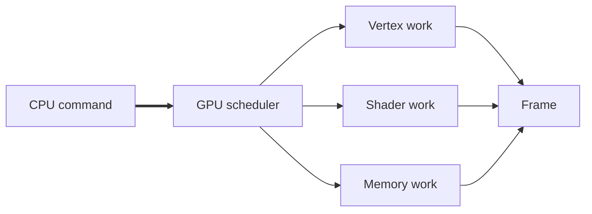
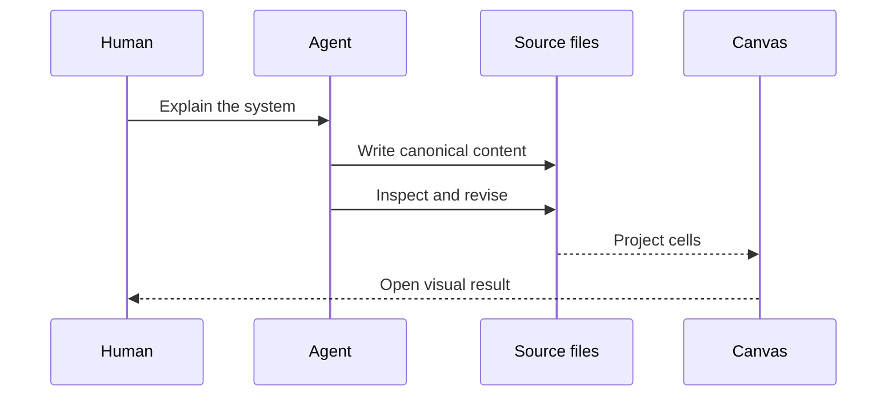

# CharDesk visual casebook

[1;38;2;9;105;218mCASE 01 · PARALLEL MACHINE[0m

╭──────────────╮      ╭──────────────────────╮
│ CPU · serial ├─────>│ GPU · parallel       │
╰──────────────╯      │ ┌──┬──┬──┬──┬──┬──┐  │
                      │ │01│02│03│04│05│06│  │
command stream        │ ├──┼──┼──┼──┼──┼──┤  │
────────────────────> │ │07│08│09│10│11│12│  │
                      │ └──┴──┴──┴──┴──┴──┘  │
                      ╰──────────────────────╯

|||
## Work becomes pixels



---
[1;38;2;130;80;223mCASE 02 · EL NIÑO OBSERVATORY[0m

WEST PACIFIC                         EAST PACIFIC
Indonesia                               Americas
   ☁ ☁       trade winds →→→
≈≈≈≈≈≈╲──────────────────────────────╱≈≈≈≈≈≈  ocean
 warm pool ████████████▓▓▒▒░░░░░░░░░░ warm east
          ╲──────── thermocline ──────╱

East–west contrast: $T_1 - T_2$

|||
## Temperature anomaly

```vega-lite
{
  "title": "Niño 3.4 anomaly",
  "data": {
    "values": [
      { "month": "Jan", "value": 0.2, "error": 0.10 },
      { "month": "Apr", "value": 0.8, "error": 0.15 },
      { "month": "Jul", "value": 1.5, "error": 0.20 },
      { "month": "Oct", "value": 2.1, "error": 0.25 }
    ]
  },
  "encoding": {
    "x": { "field": "month", "type": "ordinal", "title": "Month" },
    "y": { "field": "value", "type": "quantitative", "title": "°C" },
    "yError": { "field": "error" }
  },
  "layer": [
    { "mark": "line" },
    { "mark": "point" },
    { "mark": "errorbar" }
  ]
}
```

---
[1;38;2;31;136;61mCASE 03 · AGENT DELIVERY[0m



|||
## Canonical source

```json
{
  "workspace": "research-notes",
  "panels": {
    "overview": "panels/overview.panel",
    "evidence": "panels/evidence.panel"
  },
  "revision": 3
}
```

|||
[1mDelivery[0m

╭─────────────────────╮
│ [38;2;31;136;61m● source valid[0m      │
│ [38;2;9;105;218m● canvas opened[0m     │
│ [38;2;130;80;223m● artifact ready[0m    │
╰─────────────────────╯

| Artifact | Role |
| --- | --- |
| `.panel` | editable source |
| Canvas | human view |
