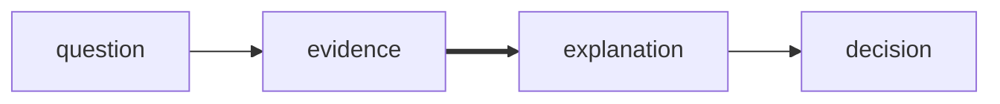
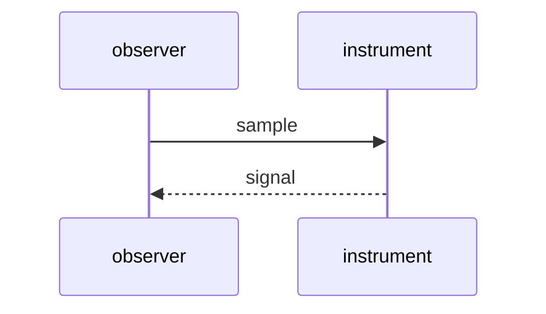

# Materials on the desk

A scene is composed, not listed. Words, lines, symbols, color, diagrams, plots,
formulas, and code can share one surface. The default face carries CJK,
monochrome emoji, symbols, and Nerd Font icons.

```chardesk
[1;38;2;9;105;218mMEANING[0m ──chooses──> [1mFORM[0m
                         │
       prose · diagram · signal · space
```

## Form can carry the explanation

Characters establish geometry. Whitespace sets rhythm. SGR carries hierarchy,
focus, fields, and signal; ESC-less OSC 8 carries a safe `http`, `https`,
`mailto`, relative, or fragment link.

```chardesk
[1;38;2;9;105;218mFORM FOLLOWS MEANING[0m

                         [90mspace holds the pause[39m
small voice ─────────────╮
                        ├────────> [7m FOCUS [27m
[30;48;2;255;189;46m atmosphere [0m ──────────╯                  [38;2;31;136;61m● signal[0m

                  
                  │       [3mthe line becomes direction[23m
origin ───────────┼──────────────────────────────> arrival
                  │
                  ╰── ▁ ▂ ▃ ▅ ▇  rhythm

[90ma trace can fade ┄┄┄┄┄┄┄┄┄┄>[39m [1mwhat matters stays[22m
]8;;https://chardesk.com\open the living surface ↗]8;;\
```

## Relationships choose their own grammar





## Measures still belong to the scene

```chardesk
[1;38;2;9;105;218mOCEAN OBSERVATORY · EQUATORIAL PACIFIC[0m

WEST                                                    EAST
Indonesia                                           Americas
   ☁ ☁          trade winds →→→
≈≈≈≈≈≈≈╲────────────────────────────────────────╱≈≈≈≈≈≈≈  surface
 warm pool [48;2;255;189;46m            [0m▒▒░░░░░░░░░░░░░░░░░░  warm east
          ╲──────────── thermocline ────────────╱

 anomaly  [38;2;9;105;218mJan ▁[38;2;130;80;223m Apr ▃[38;2;239;68;68m Jul ▆  Oct █[0m
 confidence  ├───────────────[38;2;31;136;61m●[0m───────────────┤
```

```vega-lite
{
  "data": { "values": [
    { "month": "Jan", "anomaly": 0.2 },
    { "month": "Apr", "anomaly": 0.7 },
    { "month": "Jul", "anomaly": 1.4 },
    { "month": "Oct", "anomaly": 1.8 }
  ] },
  "mark": "line",
  "encoding": {
    "x": { "field": "month", "type": "ordinal" },
    "y": { "field": "anomaly", "type": "quantitative" }
  }
}
```

The same observation can carry a formula, a record, or a compact comparison:

$$\Delta T = T_{east} - T_{west}$$

```json
{
  "station": "equatorial-pacific",
  "anomaly": 1.8,
  "confidence": "high"
}
```

| 观测 | Observation | Value |
| --- | --- | ---: |
| 温度偏差 | Temperature anomaly | 1.8°C |

## Space is another material

`|||` opens the next field. `---` opens the next row. Content inside each field
keeps its own newlines.

```chargraph
earlier traces
wind → current
|||
new evidence
warm east
---
open questions
```
