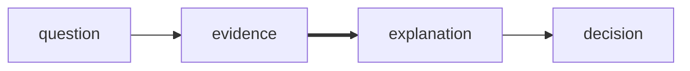
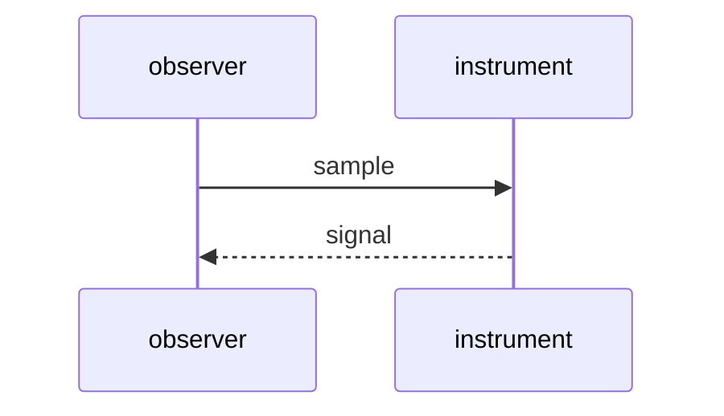

# Materials on the desk

A scene is composed, not listed. Words, lines, symbols, color, diagrams, plots,
formulas, and code can share one surface. The default face carries CJK,
monochrome emoji, symbols, and Nerd Font icons.

```chardesk
[1;38;2;9;105;218mMEANING[0m ──chooses──> [1mFORM[0m
                         │
       prose · diagram · signal · space
```

## A surface can become an instrument

Color may fill a field, mark focus, carry status, or establish hierarchy.
Characters remain the geometry.

```chardesk
[37;44m╭───────────────────────────────────────────────────────────────────────────────╮[0m
[37;44m│   [1mAMIBIOS EASY SETUP UTILITY - VERSION 1.24.2026[22m                              │[0m
[37;44m├───────────────────────────────────────────────────────────────────────────────┤[0m
[37;44m│ [7m Main [27m     Advanced     Power     Boot     Security     Exit                  │[0m
[37;44m├───────────────────────────────────────┬───────────────────────────────────────┤[0m
[37;44m│                                       │                                       │[0m
[37;44m│  System Time:       [[1m11:05:25[22m]        │ Item Specific Help                    │[0m
[37;44m│  System Date:       [[1m07/02/2026[22m]      │                                       │[0m
[37;44m│                                       │ Use [Enter], [TAB]                    │[0m
[37;44m│  Legacy Diskette A:  [1.44M, 3.5 in.] │ or [SHIFT-TAB] to select a field.     │[0m
[37;44m│                                       │                                       │[0m
[37;44m│ ┌─ Primary Master ──────────────────┐ │ Use [+] or [-] to                     │[0m
[37;44m│ │ Type:             [Auto]          │ │ configure system Time.                │[0m
[37;44m│ │ LBA Mode:         [On]            │ │                                       │[0m
[37;44m│ │ Block Mode:       [4 Sectors]     │ │                                       │[0m
[37;44m│ └───────────────────────────────────┘ │                                       │[0m
[37;44m│                                       │                                       │[0m
[37;44m│  [7m> System Memory:     640 KB        [27m  │                                       │[0m
[37;44m│    Extended Memory:   16384 MB        │                                       │[0m
[37;44m│                                       │                                       │[0m
[37;44m│ [33m  [1;31mCPU Temperature:   45°C (Normal)[22;37m   │                                       │[0m
[37;44m├───────────────────────────────────────┴───────────────────────────────────────┤[0m
[37;44m│ F1:Help  ↑↓:Select Item  +/-:Change Values  F5:Defaults  F10:Save & Exit      │[0m
[37;44m╰───────────────────────────────────────────────────────────────────────────────╯[0m
```

## A few marks can imply a product

Whitespace participates. SGR sets emphasis and color; ESC-less OSC 8 carries a
safe `http`, `https`, `mailto`, relative, or fragment link.

```chardesk
[92m󰓇[39m ]8;;https://open.spotify.com\Spotify Premium]8;;\                Desktop-PC

            [33m󰝚 [1mBlinding Lights[22;39m
        The Weeknd — After Hours

  01:45 [92m━━━━━━━━━━━━━━━━━━━━━━━[90m━━━━━━[39m 03:22

                  󰙣    󰐌    󰙡    

Next Up
  · Save Your Tears             [90m3:35[39m   [92m󰓏[39m
  · Starboy                     [90m3:50[39m   [92m󰓏[39m
  · Die For You                 [90m4:20[39m   [92m󰓏[39m

 [7;92m  󰠃  Listening on Living Room Echo  󰓃   [0m
```

## Relationships choose their own grammar





## Measures still belong to the scene

```chardesk
[1;38;2;9;105;218mOCEAN OBSERVATORY · EQUATORIAL PACIFIC[0m

WEST                                                    EAST
Indonesia                                           Americas
   ☁ ☁          trade winds →→→
≈≈≈≈≈≈≈╲────────────────────────────────────────╱≈≈≈≈≈≈≈  surface
 warm pool [48;2;255;189;46m            [0m▒▒░░░░░░░░░░░░░░░░░░  warm east
          ╲──────────── thermocline ────────────╱

 anomaly  [38;2;9;105;218mJan ▁[38;2;130;80;223m Apr ▃[38;2;239;68;68m Jul ▆  Oct █[0m
 confidence  ├───────────────[38;2;31;136;61m●[0m───────────────┤
```

```vega-lite
{
  "data": { "values": [
    { "month": "Jan", "anomaly": 0.2 },
    { "month": "Apr", "anomaly": 0.7 },
    { "month": "Jul", "anomaly": 1.4 },
    { "month": "Oct", "anomaly": 1.8 }
  ] },
  "mark": "line",
  "encoding": {
    "x": { "field": "month", "type": "ordinal" },
    "y": { "field": "anomaly", "type": "quantitative" }
  }
}
```

The same observation can carry a formula, a record, or a compact comparison:

$$\Delta T = T_{east} - T_{west}$$

```json
{
  "station": "equatorial-pacific",
  "anomaly": 1.8,
  "confidence": "high"
}
```

| 观测 | Observation | Value |
| --- | --- | ---: |
| 温度偏差 | Temperature anomaly | 1.8°C |

## Space is another material

`|||` opens the next field. `---` opens the next row. Content inside each field
keeps its own newlines.

```chargraph
earlier traces
wind → current
|||
new evidence
warm east
---
open questions
```
