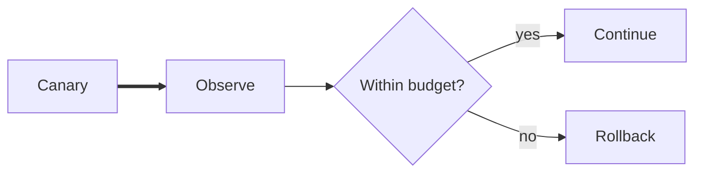

# Materials on the desk

A scene can move between language, relationships, evidence, and signal without
changing surfaces.

## Release evidence

````chargraph
# Release evidence

The canary is **stable** after cache warm-up.

|||

| Signal | Now | Reading |
| --- | ---: | --- |
| p95 latency | 184 ms | recovered |

$$headroom = budget - observed$$

---



---

```vega-lite
{"data":{"values":[{"minute":0,"latency":240},{"minute":5,"latency":205},{"minute":10,"latency":184}]},"mark":"line","encoding":{"x":{"field":"minute","type":"quantitative"},"y":{"field":"latency","type":"quantitative"}}}
```
````

## A frame through the GPU

```chardesk
[1;38;2;9;105;218m显卡在一帧里做了什么？[0m
[38;2;88;96;105m把一组数字，变成屏幕上的光。[0m

╭──────────────────────────╮
│ [1mCPU · 导演[22m               │
│ 准备场景与绘制指令       │
╰────────────┬─────────────╯
             │ draw calls
             ▼
╭──────────────────────────╮       ╭──────────────────────────╮
│ [1;38;2;130;80;223mGPU · 并行画师[0m           │◀─────▶│ [1;38;2;9;105;218m显存 · 工作台[0m            │
│ 数千核心同时计算像素     │ data  │ 模型 · 纹理 · 帧缓冲区   │
╰────────────┬─────────────╯       ╰──────────────────────────╯
             │ pixels
             ▼
╭──────────────────────────╮
│ [1;38;2;31;136;61m显示器 · 每秒刷新[0m        │
│ RGB 子像素把结果变成光   │
╰──────────────────────────╯
```

## Workroom pulse

```chardesk
[1;38;2;9;105;218m󰆍 WORKROOM[0m                         [38;2;88;96;105m09:41 · ONLINE[0m
[1;38;2;31;136;61m● ALL SYSTEMS OPERATIONAL[0m

human request
     │
     ▼
[38;2;9;105;218m󰚩 agent[0m ───edits───> [1mshared canvas[22m
     ▲                    │
     ╰──────feedback──────╯

progress [38;2;9;105;218m━━━━━━━━━━━━━━━━━━━━[38;2;210;215;222m━━━━━━[0m 74%
[38;2;88;96;105m󰜘 climate brief · 󰙅 GPU explainer · 󰐕 new scene[0m
```
