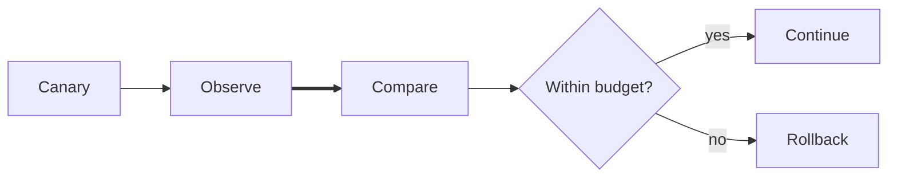

# Materials on the desk

A scene can move between language, relationships, evidence, and signal without
changing surfaces.

````chargraph
# Release evidence review

The canary is **healthy enough to continue**.
Latency recovered after cache warm-up; errors remain
inside budget.

|||

## Signals

| Signal | Now | Reading |
| --- | ---: | --- |
| p95 latency | 184 ms | recovered |
| error rate | 0.3% | within budget |

$$headroom = budget - observed$$

[38;2;31;136;61m steady[0m · [38;2;245;158;11m⚠️[0m watch the tail

---



---

> **Decision:** continue the canary and review again after 15 minutes.

```json
{
  "decision": "continue",
  "confidence": 0.86,
  "review_after_minutes": 15
}
```
````
