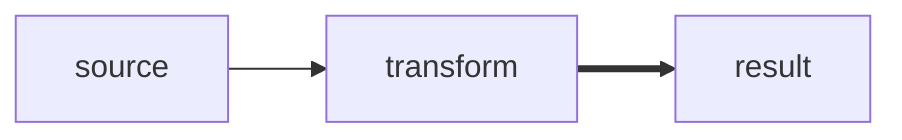
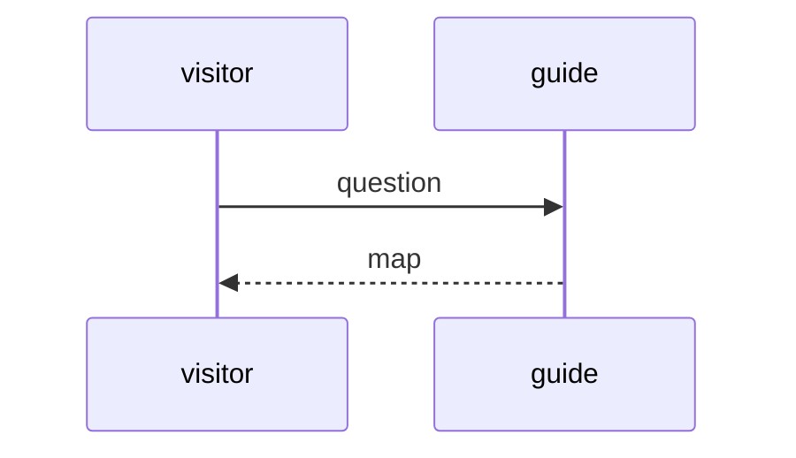

# Materials on the desk

Words, lines, symbols, color, diagrams, plots, formulas, and code can share one
surface. The scene decides which materials belong together.

```text
[1;38;2;9;105;218mSignal[0m
wind ─────────────→ coast
East–west contrast: $T_1 - T_2$
```





```vega-lite
{
  "data": { "values": [
    { "quarter": "Q1", "demand": 2 },
    { "quarter": "Q2", "demand": 7 }
  ] },
  "mark": "line",
  "encoding": {
    "x": { "field": "quarter", "type": "ordinal" },
    "y": { "field": "demand", "type": "quantitative" }
  }
}
```

```json
{
  "workspace": "field-notes",
  "revision": 3
}
```

| Language | Greeting |
| --- | --- |
| 한국어 | 안녕하세요 |

Spatial seams place independent fields:

```text
earlier traces
|||
new evidence
---
open questions
```
