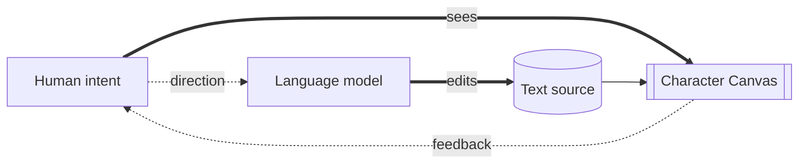
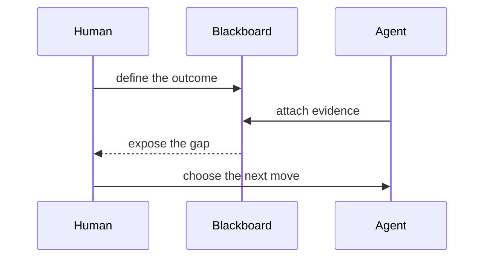

# Materials on the desk

A scene can move between language, relationships, evidence, and signal without
changing surfaces.

## A shared medium

````chargraph
# [1;38;2;9;105;218mCHAR DESK[0m · A SHARED VISUAL MEDIUM
[38;2;88;96;105mHumans read a scene. Language models edit its tokens.[0m

---



---

[1;38;2;255;255;255;48;2;9;105;218m SEE [0m
layout · rhythm · emphasis
|||
[1;38;2;255;255;255;48;2;130;80;223m EDIT [0m
tokens · files · diffs
|||
[1;38;2;255;255;255;48;2;31;136;61m SHARE [0m
one artifact · two readers

---

> [1mText for the model. A canvas for you.[22m
````

## A frame through the GPU

```chardesk
[1;38;2;9;105;218m显卡在一帧里做了什么？[0m
[38;2;88;96;105m把一组数字，变成屏幕上的光。[0m

╭──────────────────────────╮
│ [1mCPU · 导演[22m               │
│ 准备场景与绘制指令       │
╰────────────┬─────────────╯
             │ draw calls
             ▼
╭──────────────────────────╮       ╭──────────────────────────╮
│ [1;38;2;130;80;223mGPU · 并行画师[0m           │◀─────▶│ [1;38;2;9;105;218m显存 · 工作台[0m            │
│ 数千核心同时计算像素     │ data  │ 模型 · 纹理 · 帧缓冲区   │
╰────────────┬─────────────╯       ╰──────────────────────────╯
             │ pixels
             ▼
╭──────────────────────────╮
│ [1;38;2;31;136;61m显示器 · 每秒刷新[0m        │
│ RGB 子像素把结果变成光   │
╰──────────────────────────╯
```

## The Pacific changes direction

````chargraph
# [1;38;2;9;105;218mEL NIÑO[0m · THE PACIFIC CHANGES DIRECTION
[38;2;88;96;105mEquatorial observatory · sea-surface temperature anomaly[0m

---

[1mNORMAL YEAR[22m
WEST                              EAST
  ☁ ☁      trade winds →→→→→
≈≈≈≈≈≈≈╲_____________________╱≈≈≈≈≈≈≈
 [48;2;245;158;11m warm pool [0m  ╲__ thermocline __╱ cool ↑
|||
[1;38;2;220;38;38mEL NIÑO YEAR[0m
WEST                              EAST
         weakened winds ┄┄┄→
≈≈≈≈≈≈≈≈≈≈≈≈≈≈≈≈≈≈[48;2;245;158;11m warm east [0m
 flat thermocline ───────────────────

---

```vega-lite
{"title":"Niño 3.4 anomaly · °C","data":{"values":[{"month":"Jan","value":0.2},{"month":"May","value":0.8},{"month":"Sep","value":1.7},{"month":"Nov","value":1.9}]},"mark":"line","encoding":{"x":{"field":"month","type":"ordinal"},"y":{"field":"value","type":"quantitative","scale":{"domain":[0,2]}}}}
```

|||

## [38;2;220;38;38mCAUSE → WEATHER[0m

weaker winds
      ↓
warm water moves east
      ↓
rain follows the heat

$$\Delta T = T_{observed} - T_{normal}$$

> [1;38;2;245;158;11mAHA[0m · coupled ocean + atmosphere
````

## Three slides, one story

````chargraph
# [1;38;2;130;80;223m三枚のスライド、一つの物語[0m
[38;2;88;96;105m文字だけで、視線と時間を設計する。[0m

---

╭────────────────────────╮
│ [38;2;88;96;105m01 / 問い[0m              │
│                        │
│      情報は多い。      │
│      理解は遅い。      │
│          [1;38;2;220;38;38m？[0m            │
╰────────────────────────╯
|||
╭────────────────────────╮
│ [38;2;88;96;105m02 / 発見[0m              │
│                        │
│   言葉 + 空間 + 色     │
│          ↓             │
│     [1;38;2;9;105;218m構造が見える[0m       │
╰────────────────────────╯
|||
╭────────────────────────╮
│ [38;2;88;96;105m03 / 行動[0m              │
│                        │
│     人が理解する       │
│          ⇅             │
│   [1;38;2;31;136;61mAI が編集する[0m        │
╰────────────────────────╯

---

問い ─────────> 発見 ─────────> 行動

> [1m改ページではなく、意味の転換がスライドを進める。[22m
````

## Workroom pulse

```chardesk
[1;38;2;9;105;218m󰆍 WORKROOM[0m                         [38;2;88;96;105m09:41 · ONLINE[0m
[1;38;2;31;136;61m● ALL SYSTEMS OPERATIONAL[0m

human request
     │
     ▼
[38;2;9;105;218m󰚩 agent[0m ───edits───> [1mshared canvas[22m
     ▲                    │
     ╰──────feedback──────╯

progress [38;2;9;105;218m━━━━━━━━━━━━━━━━━━━━[38;2;210;215;222m━━━━━━[0m 74%
[38;2;88;96;105m󰜘 climate brief · 󰙅 GPU explainer · 󰐕 new scene[0m
```

## The release room

````chargraph
# [1;38;2;130;80;223mRELEASE ROOM[0m · HUMAN + AGENT BLACKBOARD
[38;2;88;96;105mThe source changes. The room remembers why.[0m

---

 [1mGOAL[22m                  [1mEVIDENCE[22m
   │              tests  [38;2;31;136;61m████████ 248[0m
   │              a11y   [38;2;245;158;11m██████░░   6[0m
   ╰──────────┬───────────────╯
              ▼
       ╭──────────────╮
       │ [1;38;2;9;105;218mSHIP DECISION[0m│
       │     HOLD     │
       ╰──────┬───────╯
              │ missing keyboard trace
              ▼
           [1;38;2;220;38;38mACTION[0m
|||


---

[1;38;2;255;255;255;48;2;220;38;38m BLOCKED [0m trace · [1;38;2;255;255;255;48;2;245;158;11m NEXT [0m reproduce → fix · [1;38;2;255;255;255;48;2;31;136;61m DONE [0m verify

---

> [1mThe Blackboard is not a status report. It is shared working memory.[22m
````
