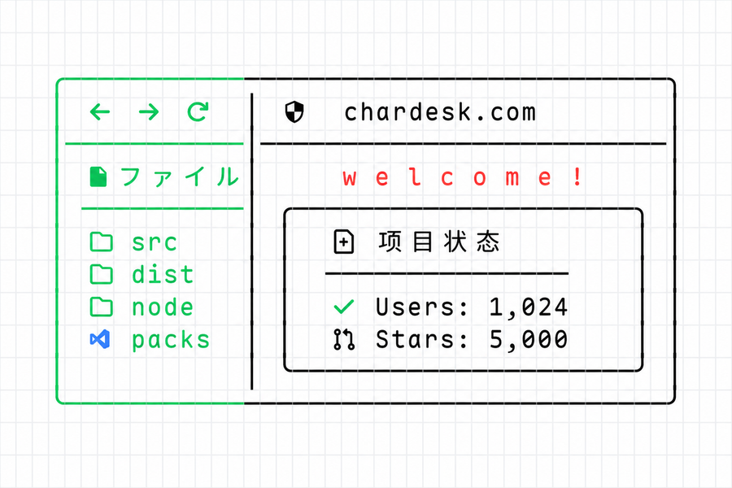
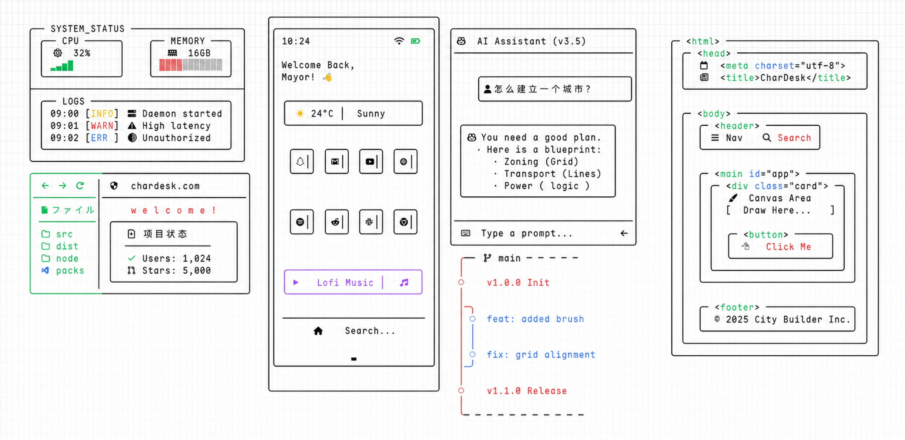

## Star History

<a href="https://www.star-history.com/?repos=Sayhi-bzb%2FAsciiCanvas&type=date&logscale=&legend=top-left">
 <picture>
   <source media="(prefers-color-scheme: dark)" srcset="https://api.star-history.com/chart?repos=Sayhi-bzb/AsciiCanvas&type=date&theme=dark&legend=top-left" />
   <source media="(prefers-color-scheme: light)" srcset="https://api.star-history.com/chart?repos=Sayhi-bzb/AsciiCanvas&type=date&legend=top-left" />
   
 </picture>
</a>

[English] | [简体中文](./README.zh-CN.md)

# ASCII Canvas

[](https://opensource.org/licenses/MIT)
[](https://react.dev/)
[](https://www.typescriptlang.org/)
[](https://yjs.dev/)
[](https://ascii-canvas.pages.dev/)

> **A Unicode grid editor for freeform drawing, structured ASCII UI composition, and frame-based ASCII animation.**

<div align="center">
  
</div>

<br />

<p align="center">
  
</p>

<p align="center">
  <a href="https://ascii-canvas.pages.dev/">
    
  </a>
</p>

---

## Core Features

**ASCII Canvas** renders editable Unicode grids instead of opaque pixels. It is built for drawings and UI surfaces that humans can inspect visually and LLMs can still read as text.

It supports three session modes:

- **Freeform**: an infinite ASCII canvas for sketching, diagrams, terminal-style layouts, and exploratory drawing.
- **Structured**: a semantic canvas where text, backgrounds, boxes, split boxes, and lines stay editable as structured nodes.
- **Animation**: a fixed-size frame timeline for ASCII motion work.

### 1. Structured Canvas

- **Structured nodes**: compose scenes from `text`, `bg`, `box`, `splitBox`, and `line` nodes instead of flattening everything into plain text.
- **Components tab**: drag reusable UI molecules such as buttons, badges, inputs, cards, tables, charts, progress bars, calendars, and scroll areas.
- **Template tab**: insert full scene examples such as Safari, File tree, Timeline, Snippet, and Terminal.
- **Layer-aware backgrounds**: `bg` nodes can sit under text and borders as real background layers, or above content when deliberately reordered.
- **Split layouts**: `splitBox` supports resizable regions for panels, cards, terminals, and compound UI sketches.

### 2. Structured Editing

- **Direct manipulation**: select one or many structured nodes, move them together, and resize box, background, split box, and line shapes with handles.
- **Text editing**: double-click structured text to edit it in place; click elsewhere to leave editing mode.
- **Selection formatting**: apply toolbar changes to selected text ranges instead of only whole text nodes.
- **Shape styling**: control character color for box, split box, and line strokes; control background fill separately for `bg` layers.
- **Surface and structure copy**: copy structured data inside Structured mode, or paste selected structured surfaces into Freeform mode.

### 3. Freeform Drawing

- **Multi-layer rendering**: background, scratch, and UI layers keep interaction responsive.
- **Grid-aware Unicode**: CJK, Emoji, Nerd Font, PUA icons, and box drawing characters are handled as grid cells.
- **Smart text flow**: newline indentation and two-cell tab stepping keep text aligned.
- **Character library**: browse Unicode, Nerd Font, Emoji, and Box Drawing characters from the right sidebar.
- **Precision selection**: drag rectangular selections, use `Shift + Click` anchor selection, and fill selected areas with typed characters.

### 4. Animation Workflow

- **Fixed canvas presets**: start sessions with sizes such as `80x25`, `64x64`, and `128x128`, or enter custom dimensions.
- **Frame sidebar**: add, duplicate, delete, reorder, and rename frames with compact previews.
- **Onion skin playback**: ghost neighboring frames for frame-by-frame drawing.
- **Export ready**: export animation data as JSON, GIF, asciinema `.cast`, or ANSI text for the current frame.

### 5. Clipboard, ANSI, And Protocol

- **Context menu**: copy, copy as ANSI, cut, paste, and delete from the canvas.
- **ANSI import/export**: paste standard ESC ANSI or ANSI-like text such as `[38;2;190;24;93m...`, interpreted by the [AsciiCanvas Text Protocol v1](packages/protocol/spec/v1.md).
- **Portable rendering**: use [`@ascii-canvas/fonts`](packages/fonts/README.md) for the default renderer font profile and self-hosted glyph assets.
- **Terminal style parsing**: supports 8-color, bright 16-color, 256-color, truecolor SGR, and attributes such as bold, italic, underline, and strikethrough.
- **Document protocol**: JSON protocol v1 covers Freeform, Structured, and Animation sessions for durable import/export.

---

## Showcase

<div align="center">
  
</div>

---

## Tech Stack

- **Frontend**: React 19, TypeScript, Vite 7
- **State Management**: Zustand 5 with slice-based store modules
- **Styling**: Tailwind CSS 4, Radix UI, shadcn/ui-style primitives
- **Rendering**: layered Canvas 2D rendering with grid metrics for wide characters
- **Font routing**: [self-hosted font and Unicode routing](docs/font-unicode-routing.md)
- **Character catalog**: [curated packs and lazy Unicode explorer](docs/character-library.md)
- **Synchronization**: Yjs / Y-IndexedDB
- **Gestures**: @use-gesture/react
- **Animation Export**: JSON, in-browser GIF generation, asciinema `.cast`, and ANSI text
- **Terminal Text**: SGR foreground/background, text attributes, and ANSI/ANSI-like import/export

---

## Getting Started

### Installation

```bash
git clone https://github.com/Sayhi-bzb/ascii-canvas.git
cd ascii-canvas
npm install
```

### Development

```bash
npm run dev
```

### Build

```bash
npm run build
```

---

## Shortcuts And Workflows

| Action | Shortcut / Gesture | Description |
| :-- | :-- | :-- |
| Freeform selection | `Drag` | Select a rectangular grid area |
| Anchor selection | `Shift + Click` | Select from the anchor point to the current point |
| Fill selection | `Char Key` | Fill active selections with the typed character |
| Smart newline | `Enter` | Insert a new line with inherited indentation |
| Pave space | `Tab` | Move the text cursor right by 2 grid units |
| Context menu | `Right Click` | Copy, copy as ANSI, cut, paste, and delete |
| Structured text edit | `Double Click` text | Enter in-place structured text editing |
| Structured insert | Drag from sidebar | Drop components or templates into the structured canvas |

Paste accepts plain text, app-native rich clipboard data, and ANSI/ANSI-like styled terminal text. Animation sessions expose frame stepping, playback, loop, onion skin, and JSON/GIF/asciinema `.cast` export.

---

## Roadmap

- [x] Multi-layer canvas rendering engine.
- [x] Real-time collaboration via Yjs.
- [x] Intelligent indentation and tab system.
- [x] Context menu and ANSI clipboard integration.
- [x] Fixed-size animation mode with timeline, onion skin, and export.
- [x] Structured canvas with editable text, backgrounds, boxes, split boxes, and lines.
- [x] Structured Components and Templates libraries.
- [x] JSON protocol v1 for Freeform, Structured, and Animation sessions.
- [ ] **NES (Next Edit Suggestion)**: predictive character placement based on layout patterns.
- [ ] **AI Chat Integration**: natural language interface for generating canvas components.
- [ ] Full ANSI terminal sequence workspace and SVG export support.

---

## License

This project is licensed under the **MIT License**. See the [LICENSE](LICENSE) file for details.
