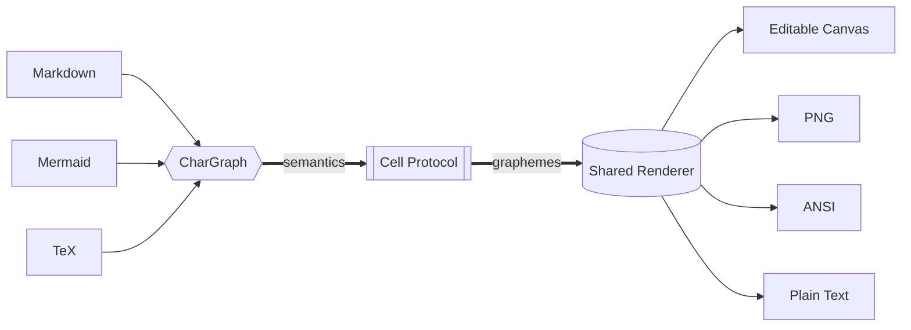

# [38;2;79;70;229mONE SOURCE[0m → [38;2;8;145;178mSIX ARTIFACTS[0m
[38;2;100;116;139mCharDesk architecture · the source stays text, the result stays editable[0m
---

---
╭──────────────────────────────╮
│ [1;38;2;79;70;229m01 · PARSE[0m                   │
│ Structure becomes semantics  │
│ Markdown · Mermaid · TeX     │
╰──────────────────────────────╯
|||
╭──────────────────────────────╮
│ [1;38;2;8;145;178m02 · MATERIALIZE[0m             │
│ Semantics become visible     │
│ grapheme-aware Canvas cells  │
╰──────────────────────────────╯
|||
╭──────────────────────────────╮
│ [1;38;2;22;163;74m03 · DELIVER[0m                 │
│ One renderer, many surfaces  │
│ Canvas · PNG · ANSI · Text   │
╰──────────────────────────────╯
---
[1;38;2;255;255;255;48;2;79;70;229m INPUTS · 4 [0m
|||
[1;38;2;255;255;255;48;2;8;145;178m CELL MODEL · 1 [0m
|||
[1;38;2;255;255;255;48;2;22;163;74m OUTPUTS · 4 [0m
|||
[1;38;2;255;255;255;48;2;100;116;139m HOST STATE · 0 [0m
---
> [1;38;2;8;145;178mONE INVARIANT[0m · Source semantics flow downward. Host state never leaks into Protocol.

[1;38;2;79;70;229mResult:[0m the artifact remains editable after materialization.
