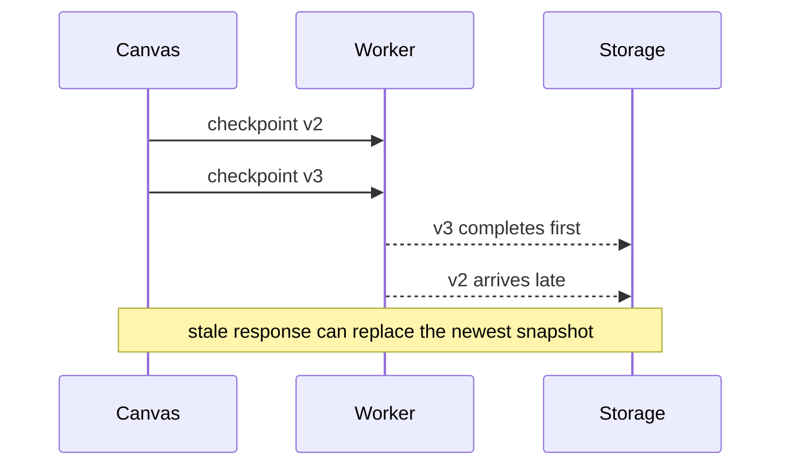
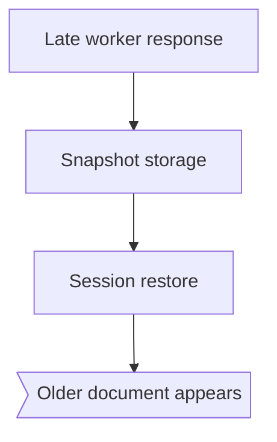

# [38;2;124;58;237mFASTER CHECKPOINTS[0m · [38;2;220;38;38mONE RACE[0m
[1;38;2;255;255;255;48;2;124;58;237m PR #284 [0m  [38;2;100;116;139mmoving persistence into a worker[0m
---
```diff
- const snapshot = encode(document)
- await storage.put(snapshot)
+ const request = createCheckpointRequest(document)
+ const snapshot = await checkpointWorker.run(request)
+ await storage.put(snapshot.bytes)
```
|||
╭──────────────────────────────╮
│ [1;38;2;124;58;237mINTENT[0m                       │
│ Move encoding off main thread│
│                              │
│ UI blocked        →  [38;2;22;163;74mno[0m      │
│ Atomic writes     →  [38;2;22;163;74myes[0m     │
│ Response ordering →  [38;2;220;38;38mmissing[0m │
╰──────────────────────────────╯
---
## [38;2;220;38;38mTHE RACE[0m

|||
## [38;2;220;38;38mBLAST RADIUS[0m

---
╭────────────────────────╮
│ [38;2;22;163;74m✓ versioned envelope[0m   │
│ [38;2;22;163;74m✓ atomic writes[0m        │
│ [38;2;220;38;38m✕ stale-response test[0m  │
╰────────────────────────╯
|||
╭──────────────────────────────────────────────╮
│ [1;38;2;220;38;38mVERDICT[0m                                      │
│ [1;38;2;255;255;255;48;2;220;38;38m CHANGES REQUESTED [0m · 1 blocking safety test │
╰──────────────────────────────────────────────╯
---
> [1;38;2;255;255;255;48;2;124;58;237m AHA [0m The worker makes the happy path faster, but completion order is now part of correctness.
