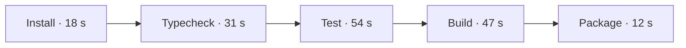

# [38;2;22;163;74m18 SECONDS[0m OF HEADROOM
[1;38;2;255;255;255;48;2;22;163;74m PASS [0m  [38;2;100;116;139mmain@8f14c2a · budget 180 s · actual 162 s[0m
---

---
```vega-lite
{
  "title": "Build duration · seconds",
  "data": {"values": [
    {"revision": "baseline", "seconds": 188},
    {"revision": "current", "seconds": 162},
    {"revision": "budget", "seconds": 180}
  ]},
  "mark": "bar",
  "encoding": {
    "x": {"field": "revision", "type": "nominal", "title": ""},
    "y": {"field": "seconds", "type": "quantitative", "scale": {"domain": [0, 200]}}
  }
}
```
|||
╭────────────────────────────╮
│ [1;38;2;37;99;235mPIPELINE[0m                   │
│ [38;2;22;163;74m●[0m  install          18 s   │
│ [38;2;22;163;74m●[0m  typecheck        31 s   │
│ [38;2;22;163;74m●[0m  test             54 s   │
│ [38;2;22;163;74m●[0m  build            47 s   │
│ [38;2;22;163;74m●[0m  package          12 s   │
├────────────────────────────┤
│ TOTAL              162 s   │
│ BUDGET              180 s  │
│ [1;38;2;22;163;74mHEADROOM             18 s[0m  │
╰────────────────────────────╯
---
[1;38;2;255;255;255;48;2;37;99;235m 281 TESTS [0m
|||
[1;38;2;255;255;255;48;2;22;163;74m 13.8% FASTER [0m
|||
[1;38;2;255;255;255;48;2;37;99;235m 5 / 5 JOBS [0m
|||
[1;38;2;255;255;255;48;2;22;163;74m 4 ARTIFACTS [0m
---
╭────────────────────────────────────────────────────────────╮
│ [1;38;2;255;255;255;48;2;22;163;74m SHIP GATE · PASS [0m                                         │
│ Web · CLI · Docs · Source maps are ready                   │
╰────────────────────────────────────────────────────────────╯
