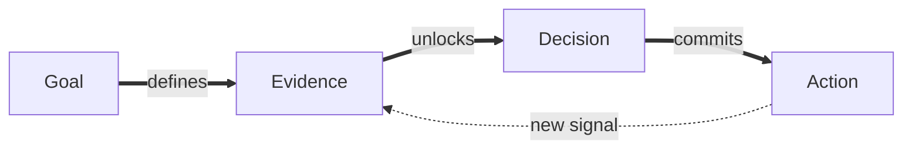

# [38;2;8;145;178mEVIDENCE[0m MOVES THE WORK
[1;38;2;255;255;255;48;2;8;145;178m LIVE BLACKBOARD [0m  [38;2;100;116;139mRelease Readiness[0m
---
╭──────────────────────────╮
│ [1;38;2;8;145;178m1 · GOAL[0m                 │
│                          │
│ One canonical chart path │
│ Deterministic PNG output │
│ Zero strict diagnostics  │
│                          │
│ [38;2;8;145;178m▰▰▰▰▰  LOCKED[0m            │
╰──────────────────────────╯
|||
╭──────────────────────────╮
│ [1;38;2;22;163;74m2 · EVIDENCE[0m             │
│                          │
│ 250 CharGraph tests      │
│ 18 CLI tests             │
│ Irregular X verified     │
│                          │
│ [38;2;22;163;74m▰▰▰▰▰  VERIFIED[0m          │
╰──────────────────────────╯
|||
╭──────────────────────────╮
│ [1;38;2;124;58;237m3 · DECISION[0m             │
│                          │
│ D3 owns numeric scales   │
│ Protocol owns width      │
│ Canvas stores cells      │
│                          │
│ [38;2;124;58;237m▰▰▰▰▰  ACCEPTED[0m          │
╰──────────────────────────╯
|||
╭──────────────────────────╮
│ [1;38;2;245;158;11m4 · ACTION[0m               │
│                          │
│ Migrate Mermaid XY       │
│ Reserve title space      │
│ Verify CJK + negatives   │
│                          │
│ [38;2;245;158;11m▰▰▱▱▱  IN PROGRESS[0m       │
╰──────────────────────────╯
---

---
╭────────────────────────────────────────────────────────────╮
│ [1;38;2;220;38;38mBLOCKER[0m                                                    │
│ [38;2;220;38;38mLegacy Mermaid XY still uses its original renderer[0m         │
╰────────────────────────────────────────────────────────────╯
|||
[1;38;2;255;255;255;48;2;8;145;178m OWNER · AGENT [0m
[38;2;100;116;139mREVIEW · HUMAN[0m
---
> [1;38;2;255;255;255;48;2;8;145;178m AHA [0m Progress is not a list of tasks. Evidence is the state transition.
