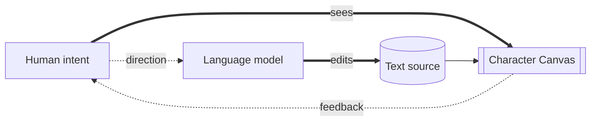

# [1;38;2;9;105;218mCHAR DESK[0m · A SHARED VISUAL MEDIUM
[38;2;88;96;105mHumans read a scene. Language models edit its tokens.[0m
---

---
[1;38;2;255;255;255;48;2;9;105;218m SEE [0m
layout · rhythm · emphasis
|||
[1;38;2;255;255;255;48;2;130;80;223m EDIT [0m
tokens · files · diffs
|||
[1;38;2;255;255;255;48;2;31;136;61m SHARE [0m
one artifact · two readers
---
╭────────────────────────────────────────────────────────────────────╮
│ [38;2;9;105;218mUnicode grid[0m ── geometry     [38;2;130;80;223mANSI[0m ── signal     [38;2;31;136;61mSource[0m ── memory   │
╰────────────────────────────────────────────────────────────────────╯

> [1mText for the model. A canvas for you.[22m
