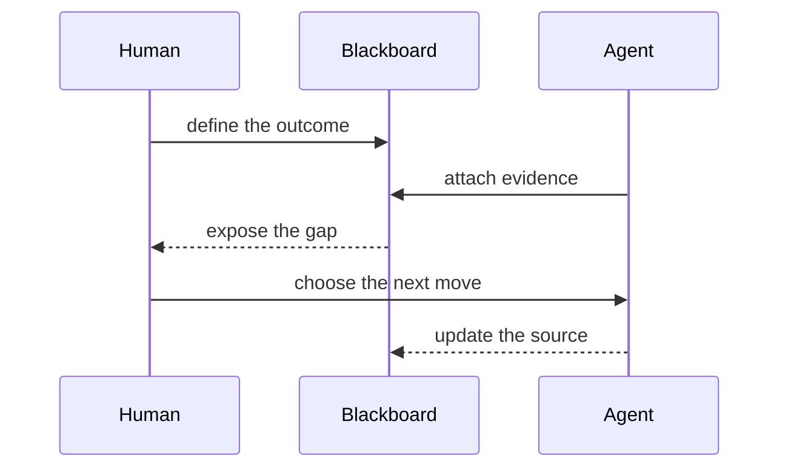

# [1;38;2;130;80;223mRELEASE ROOM[0m · HUMAN + AGENT BLACKBOARD
[38;2;88;96;105mThe source changes. The room remembers why.[0m
---
       [1mGOAL[22m                         [1mEVIDENCE[22m
        │                              │
        │                     tests  [38;2;31;136;61m████████ 248[0m
        │                     render [38;2;31;136;61m████████  18[0m
        │                     a11y   [38;2;245;158;11m██████░░   6[0m
        │                              │
        ╰──────────────┬───────────────╯
                       ▼
                ╭──────────────╮
                │ [1;38;2;9;105;218mSHIP DECISION[0m│
                │     HOLD     │
                ╰──────┬───────╯
                       │ missing keyboard trace
                       ▼
                    [1;38;2;220;38;38mACTION[0m
|||

---
[1;38;2;255;255;255;48;2;220;38;38m BLOCKED [0m keyboard trace
|||
[1;38;2;255;255;255;48;2;245;158;11m NEXT [0m reproduce → fix → verify
|||
[1;38;2;255;255;255;48;2;31;136;61m DONE [0m renderer · protocol · CLI
---
> [1mThe Blackboard is not a status report. It is shared working memory.[22m
